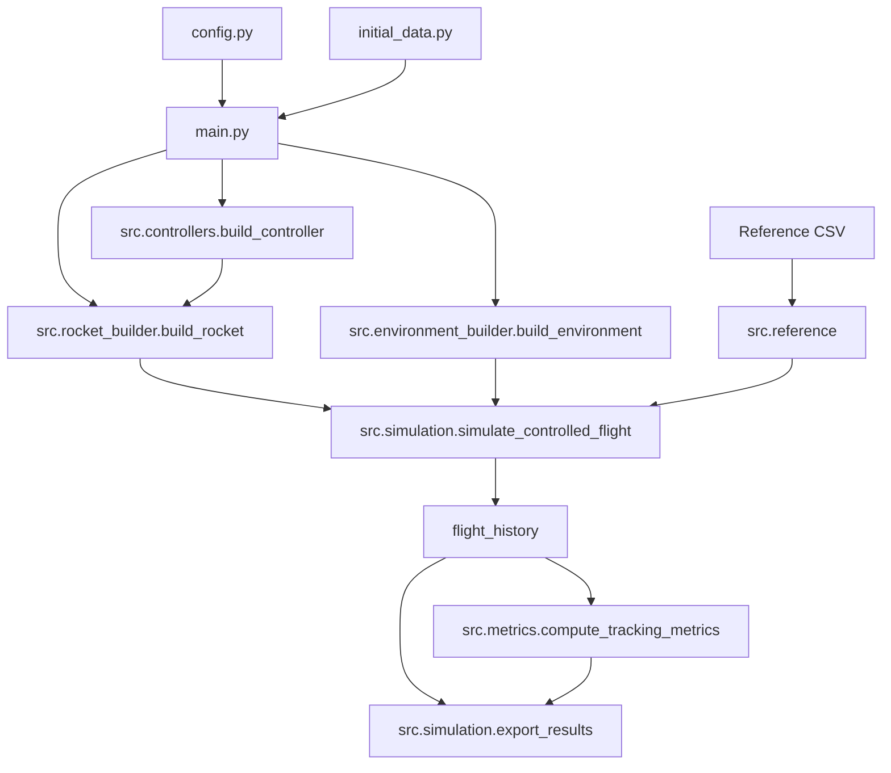
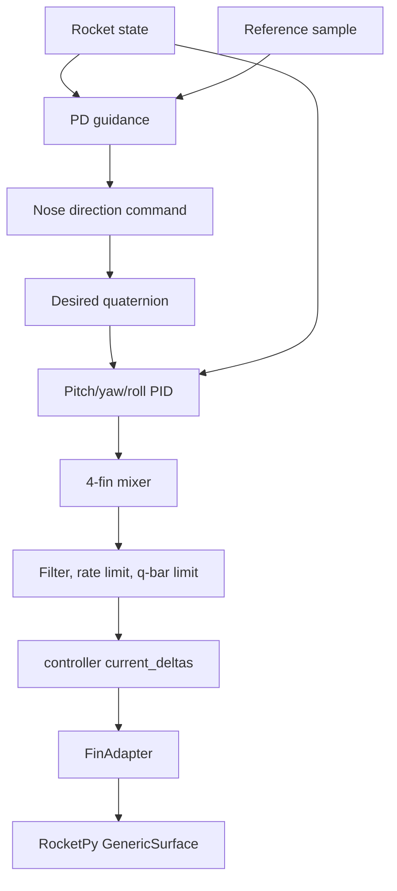

# Architecture Documentation

## System Overview

The simulator runs a closed-loop 6-DOF RocketPy flight with active rear-fin control. The main workflow is intentionally sequential:

1. Load configuration and case data.
2. Load the reference trajectory.
3. Build controller state.
4. Build environment.
5. Build rocket and active control surface.
6. Simulate closed-loop flight.
7. Compute metrics.
8. Export results and plots.

## Main Data Flow



## RocketPy Integration

`src.simulation.simulate_controlled_flight()` registers a RocketPy private `_Controller` callback. At each controller callback, RocketPy provides the state vector:

```text
[x, y, z, vx, vy, vz, q0, q1, q2, q3, wx, wy, wz]
```

Positions from RocketPy include launch elevation. The exported `position_enu_m` subtracts the launch position so all controller outputs, references, metrics, and plots use local ENU coordinates.

## Control Pipeline



The controller state is a mutable dictionary. `FinAdapter` reads `controller["current_deltas"]` through a module-level state reference, so RocketPy coefficient evaluation always sees the latest command.

## Output Flow

`src.simulation.export_results()` writes:

- CSV state history.
- Summary CSV.
- Metrics JSON.
- Controller diagnostics CSV.
- Effective config JSON.
- Rocket TOML copy.
- Rocket artifacts JSON.
- Simulation plots.
- Control-phase plots.

The gain sweep uses the same build/simulate path but writes compact sweep outputs to `tools/results/sweep/`.
