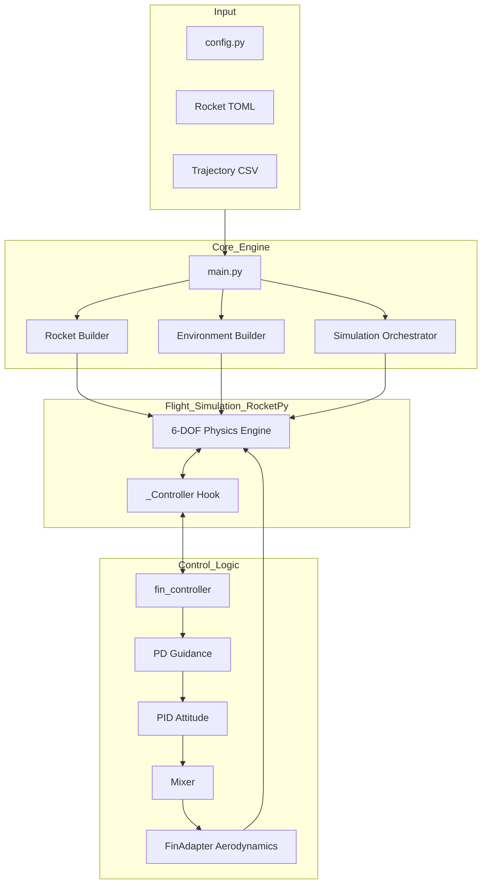

# Architecture Documentation

## System Overview

The Rocket Control TFG project implements a closed-loop trajectory control system for sounding rockets using rear-fin deflection. The system integrates with RocketPy's 6-DOF flight simulation using its internal `_Controller` infrastructure.

## System Architecture

## Data Flow

### 1. Initialization
- **Configuration**: `config.py` acts as the single source of truth for paths, launch site, and simulation parameters.
- **Environment**: Sets up the RocketPy `Environment` using location data from `config.py`.
- **Rocket**: Constructs the `Rocket` assembly from the TOML file specified in `config.py`.

### 2. Control Loop
During each step of the ODE solver:
- **State Feedback**: The controller receives the 13-state vector (position, velocity, quaternion, angular rates) in the local ENU frame.
- **Guidance**: Computes commanded acceleration to minimize trajectory error.
- **Attitude Control**: Determines target orientation and uses a PID loop for virtual moments.
- **Actuation**: Maps moments to fin deflections via a mixer.
- **Aerodynamics**: The `FinAdapter` applies these deflections to the aerodynamic model in real-time.

### 3. Output
- **Metrics**: Computes tracking performance (MAE, RMSE) and control effort.
- **Visualization**: Generates plots for trajectory, attitude, and actuator history.
- **Results**: Exports all data to a timestamped directory `results/YYYYMMDD_HHMMSS/`.

## Design Patterns

- **Single Source of Truth**: All simulation constants and paths reside in `config.py`.
- **Dynamic Parameters**: Rocket physics (mass, inertia, coefficients) are pulled directly from the TOML at runtime.
- **Stateful Callback**: A dictionary-based state allows the controller to maintain integrals and history across integrator steps.
