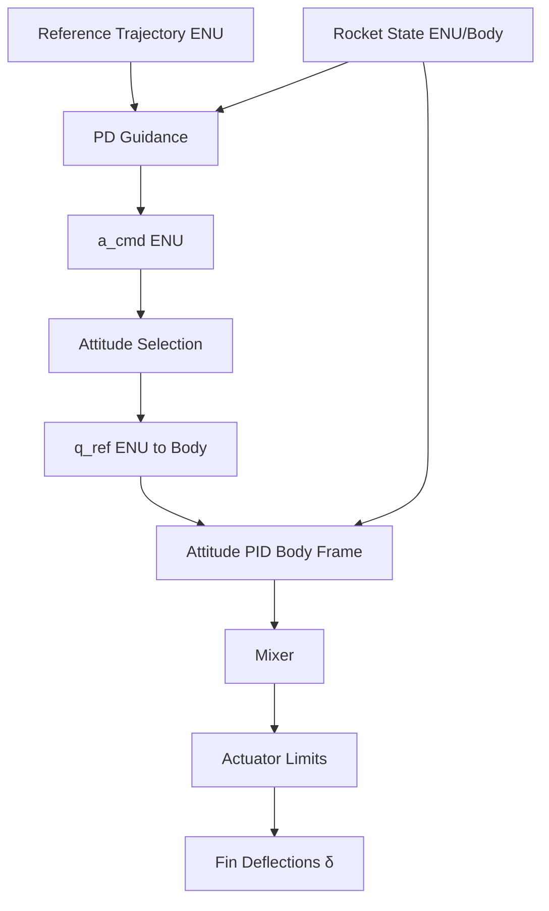

# Module: `src/controllers.py`

## Overview

Implements the **fin deflection controller** using a dual-loop architecture: an outer-loop PD guidance system and an inner-loop PID attitude controller.

## Control Architecture

## Mathematical Model

### 1. Outer-Loop Guidance

The guidance law computes a commanded acceleration $\vec{a}_{cmd}$ in the ENU frame:

$$\vec{a}_{cmd} = \vec{a}_{ref} + K_{p,guid} (\vec{p}_{ref} - \vec{p}) + K_{d,guid} (\vec{v}_{ref} - \vec{v}) + \vec{g}$$

Where:
- $\vec{a}_{ref}, \vec{p}_{ref}, \vec{v}_{ref}$ are reference acceleration, position, and velocity.
- $\vec{g} = [0, 0, g]^T$ is the gravity compensation.

### 2. Attitude Selection

The desired attitude $q_{ref}$ aligns the rocket's longitudinal axis (Body $+Z$) with the commanded acceleration:

$$\hat{d} = \frac{\vec{a}_{cmd}}{\|\vec{a}_{cmd}\|}$$
$$q_{ref} = \text{quat\_from\_vectors}(\hat{d}, [0, 0, 1]^T)$$

### 3. Inner-Loop Attitude Control (Body Frame)

The attitude control loop operates on the body-frame attitude error vector $\vec{\epsilon} = [q_{e,x}, q_{e,y}, q_{e,z}]^T$ extracted from the error quaternion $q_e = q_{ref} \otimes q_{real}^*$ (scalar-first format $[w, x, y, z]$).

To maintain constant closed-loop bandwidth across a wide dynamic pressure range, the PID gains are scaled inversely with dynamic pressure $q$:

$$q_{scale} = \min\left(\frac{q_{ref\_val}}{\max(q, q_{min})}, q_{scale\_max}\right)$$

The attitude control commands for the three body axes are:

- **Pitch (Body X):**
  $$u_{pitch} = K_{p,att} q_{scale} \epsilon_x + K_{i,att} q_{scale} \int \epsilon_x dt - K_{d,att} q_{scale} \omega_x$$

- **Yaw (Body Y):**
  $$u_{yaw} = K_{p,att} q_{scale} \epsilon_y + K_{i,att} q_{scale} \int \epsilon_y dt - K_{d,att} q_{scale} \omega_y$$

- **Roll (Body Z):**
  $$u_{roll} = K_{p,roll} q_{scale} \epsilon_z + K_{i,roll} q_{scale} \int \epsilon_z dt - K_{d,roll} q_{scale} \omega_z$$

> [!NOTE]
> The derivative gain is applied directly to the body angular rates $(\omega_x, \omega_y, \omega_z)$ rather than the numerical derivative of the error vector. This avoids derivative kick and provides excellent damping. Because of the rear-fin aerodynamic moment arm inversion (where positive deflection generates a negative pitching moment), the damping term uses a minus sign (meaning positive feedback relative to angular velocity is stabilizing).

### 4. Anti-Windup (Conditional Integration)

To prevent integrator windup during saturation (such as at lift-off or during aggressive maneuvers), a **conditional integration** strategy is used. The integrator on each axis is updated only if the predicted raw control signal for that axis does not cause any individual fin to exceed the live deflection authority limit $\delta_{limit}$:

$$\text{If } |\delta_{raw, i}| < \delta_{limit} \text{ for all affected fins, then } \int \epsilon_i dt \leftarrow \int \epsilon_i dt + \epsilon_i \cdot dt$$

### 5. Mixer

The mixer maps the virtual control commands $(u_{pitch}, u_{yaw}, u_{roll})$ to the cruciform (+) arrangement of 4 tail fins:

$$\begin{aligned}
\delta_1 &= -u_{pitch} + u_{roll} \quad \text{(Fin 1: Right, }+x_b\text{)} \\
\delta_2 &= -u_{yaw} + u_{roll} \quad \text{(Fin 2: Down, }+y_b\text{)} \\
\delta_3 &= u_{pitch} + u_{roll} \quad \text{(Fin 3: Left, }-x_b\text{)} \\
\delta_4 &= u_{yaw} + u_{roll} \quad \text{(Fin 4: Up, }-y_b\text{)}
\end{aligned}$$

This mapping ensures:
- A positive pitch command (nose-up) requests a negative deflection on Fin 1 and positive on Fin 3. In the aerodynamic model, this creates a downward force at the tail ($C_L < 0$), generating a positive (nose-up) pitching moment around the CG.
- A positive yaw command (nose-right) requests a negative deflection on Fin 2 and positive on Fin 4, creating a leftward side force and a positive (nose-right) yawing moment.
- A positive roll command (clockwise looking forward) deflects all four fins equally, producing a pure rolling torque.

### 6. Actuator Limits and Scheduling

**1. Guidance Acceleration Filter:**
To smooth out abrupt requested attitude jumps caused by noise or wind shear, a low-pass Exponential Moving Average (EMA) filter is applied to the commanded acceleration before attitude conversion:

$$\vec{a}_{cmd, filtered} = \alpha_f \vec{a}_{cmd} + (1 - \alpha_f) \vec{a}_{cmd, prev}$$

**2. Dynamic-Pressure-Based Trapezoidal Fin Authority Limits:**
To protect the actuators at high dynamic pressures and prevent saturation / windup at low speeds, the maximum allowable deflection limit ($\delta_{limit}$) is scheduled using a trapezoidal profile based on $q$:

$$\delta_{limit}(q) = \begin{cases} 
\delta_{min} & \text{if } q \le q_{min} \\
\delta_{min} + \frac{q - q_{min}}{q_{full} - q_{min}} (\delta_{max} - \delta_{min}) & \text{if } q_{min} < q < q_{full} \\
\delta_{max} & \text{if } q_{full} \le q \le q_{high} \\
\delta_{high} & \text{if } q > q_{high}
\end{cases}$$

Where:
- $\delta_{min} = 2.86^\circ$ ($0.05$ rad) under low dynamic pressure ($q < 500$ Pa) to prevent massive actuator deflection commands when there is no air to steer the vehicle.
- $\delta_{max} = 20^\circ$ ($0.349$ rad) represents the full structural deflection capability.
- $\delta_{high} = 5.73^\circ$ ($0.10$ rad) protects the fins from excessive bending moments and structural failure at extreme high speeds.

## Key Functions

- `fin_controller`: The primary stateful callback registered with RocketPy's ODE solver. Features callback idempotency guarding to prevent dual updates, calculates live atmosphere parameters, and applies the guidance/attitude/mixer/limiter pipeline.
- `_compute_qbar_authority_limit`: Computes the trapezoidal deflection limit $\delta_{limit}(q)$ for the current timestep.
- `compute_desired_attitude`: Aligns the rocket's longitudinal Z-axis with the commanded acceleration vector and zeroes out the longitudinal roll command to prevent parasitic coupling.
- `build_controller`: Initializes the controller state dictionary (integrators, history buffers, and callbacks).

