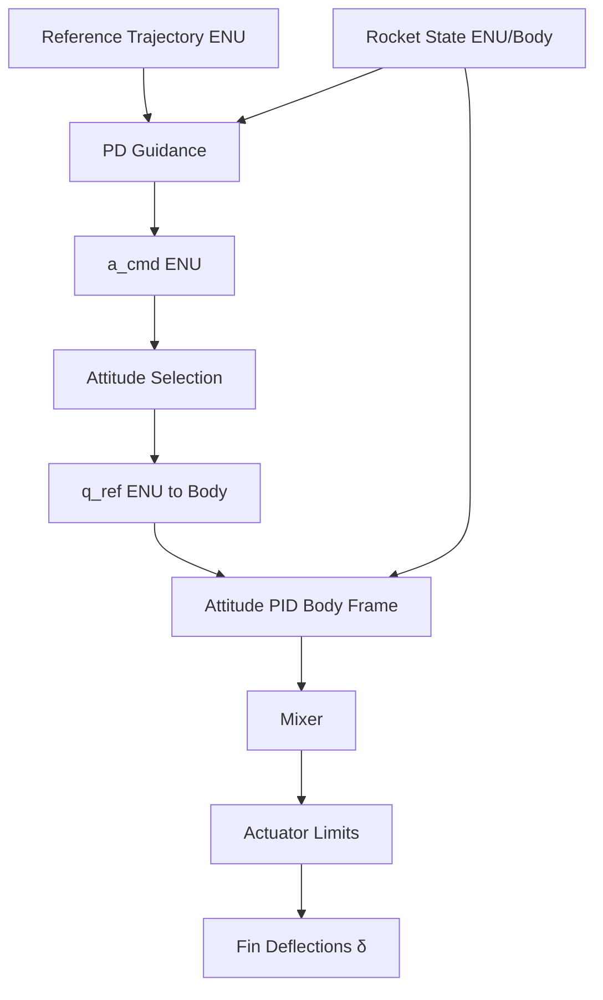

# Module: `src/controllers.py`

## Overview

Implements the **fin deflection controller** using a dual-loop architecture: an outer-loop PD guidance system and an inner-loop PID attitude controller.

## Control Architecture

## Mathematical Model

### 1. Outer-Loop Guidance

The guidance law computes a commanded acceleration $\vec{a}_{cmd}$ in the ENU frame:

$$\vec{a}_{cmd} = \vec{a}_{ref} + K_{p,guid} (\vec{p}_{ref} - \vec{p}) + K_{d,guid} (\vec{v}_{ref} - \vec{v}) + \vec{g}$$

Where:
- $\vec{a}_{ref}, \vec{p}_{ref}, \vec{v}_{ref}$ are reference acceleration, position, and velocity.
- $\vec{g} = [0, 0, g]^T$ is the gravity compensation.

### 2. Attitude Selection

The desired attitude $q_{ref}$ aligns the rocket's longitudinal axis (Body $+Z$) with the commanded acceleration:

$$\hat{d} = \frac{\vec{a}_{cmd}}{\|\vec{a}_{cmd}\|}$$
$$q_{ref} = \text{quat\_from\_vectors}(\hat{d}, [0, 0, 1]^T)$$

### 3. Inner-Loop Attitude Control

The error quaternion $q_e = q_{ref} \otimes q_{real}^*$ provides the error vector $\vec{\epsilon} = [q_{e,x}, q_{e,y}, q_{e,z}]^T$.

**Roll Control:**
$$u_{roll} = K_{p,roll} \epsilon_z - K_{d,att} \omega_z$$

**Pitch and Yaw Control:**
$$u_{pitch} = K_{p,att} \epsilon_x + K_{i,att} \int \epsilon_x dt + K_{d,att} \omega_x$$
$$u_{yaw} = K_{p,att} \epsilon_y + K_{i,att} \int \epsilon_y dt + K_{d,att} \omega_y$$

### 4. Mixer

Maps virtual controls to 4 fins in a cross (+) configuration:

$$\begin{aligned}
\delta_1 &= u_{pitch} + u_{roll} \\
\delta_2 &= u_{yaw} + u_{roll} \\
\delta_3 &= -u_{pitch} + u_{roll} \\
\delta_4 &= -u_{yaw} + u_{roll}
\end{aligned}$$

### 5. Actuator Limits and Scheduling

**Q-bar Scheduling:** The maximum deflection $\delta_{max}$ is scaled by dynamic pressure $q$ to maintain constant authority and protect the structure:

$$\delta_{limit} = \text{clamp}\left(\delta_{max,TOML} \cdot \frac{q_{ref}}{q}, \delta_{min}, \delta_{max}\right)$$

## Key Functions

- `fin_controller`: Main callback for RocketPy. Handles activation logic and integrator idempotency.
- `build_controller`: Initializes the controller state using values from `config.py` and the rocket TOML.
- `compute_desired_attitude`: Converts acceleration commands into reference quaternions.
