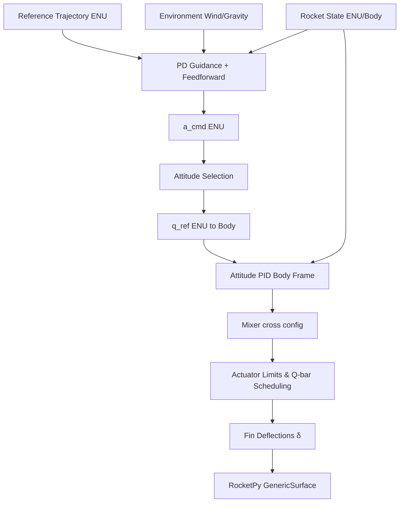

# Module: `src/controllers.py`

## Overview

Implements the **fin deflection controller** for trajectory tracking. It uses a dual-loop architecture: an outer-loop PD guidance system that generates acceleration commands, and an inner-loop PID attitude controller that maps these commands to fin deflections in the body frame.

## Control Architecture

## Mathematical Model

### 1. Outer-Loop Guidance

The guidance law computes a commanded acceleration $\vec{a}_{cmd}$ in the local ENU frame:

$$\vec{a}_{cmd} = \vec{a}_{ref} + K_{p,guid} (\vec{p}_{ref} - \vec{p}) + K_{d,guid} (\vec{v}_{ref} - \vec{v}) + \vec{g} + K_{wind} \vec{v}_{wind}$$

Where:
- $\vec{a}_{ref}, \vec{p}_{ref}, \vec{v}_{ref}$ are reference acceleration, position, and velocity.
- $\vec{g} = [0, 0, g]^T$ is the gravity compensation vector.
- $\vec{v}_{wind}$ is the local wind velocity vector.
- $K_{p,guid}, K_{d,guid}, K_{wind}$ are controller gains.

The magnitude of the correction component (excluding gravity) is limited to $a_{max,guid}$ to prevent excessive attitude commands.

### 2. Attitude Selection

The desired attitude $q_{ref}$ (ENU $\to$ Body) aligns the rocket's longitudinal axis (Body $+Z$) with the commanded acceleration vector:

$$\hat{d} = \frac{\vec{a}_{cmd}}{\|\vec{a}_{cmd}\|}$$
$$q_{ref} = \text{quat\_from\_vectors}(\hat{d}, [0, 0, 1]^T)$$

### 3. Inner-Loop Attitude Control

The error quaternion $q_e$ is computed as:

$$q_e = q_{ref} \otimes q_{real}^*$$

The error vector $\vec{\epsilon} = [q_{e,x}, q_{e,y}, q_{e,z}]^T$ is used for PID control in the body frame:

#### Roll Control (PD with Damping)
$$u_{roll} = K_{p,roll} \epsilon_z - K_{d,att} \omega_z$$

#### Pitch and Yaw Control (PID with Anti-Windup)
$$u_{pitch} = K_{p,att} \epsilon_x + K_{i,att} \int \epsilon_x dt + K_{d,att} \omega_x$$
$$u_{yaw} = K_{p,att} \epsilon_y + K_{i,att} \int \epsilon_y dt + K_{d,att} \omega_y$$

**Anti-Windup (Conditional Integration)**: The integral term is only updated if the respective axis is not saturated. Pitch saturation is checked on fins 2 and 4, and yaw saturation on fins 1 and 3.

### 4. Mixer

The virtual controls $(u_{roll}, u_{pitch}, u_{yaw})$ are mapped to 4 fins in a cross (+) configuration:

$$\begin{aligned}
\delta_1 &= u_{yaw} + u_{roll} \\
\delta_2 &= u_{pitch} + u_{roll} \\
\delta_3 &= -u_{yaw} + u_{roll} \\
\delta_4 &= -u_{pitch} + u_{roll}
\end{aligned}$$

### 5. Actuator Limits and Scheduling

**Rate Limiting**:
$$\delta_i(t) = \text{clamp}(\delta_i^{raw}, \delta_i(t-\Delta t) - \dot{\delta}_{max}\Delta t, \delta_i(t-\Delta t) + \dot{\delta}_{max}\Delta t)$$

**Q-bar Scheduling**: The maximum deflection $\delta_{limit}$ is scheduled based on dynamic pressure $q$:
- $\delta_{limit}(q)$ is reduced at low $q$ (low authority) and very high $q$ (excessive drag/loads).

$$\delta_i^{final} = \text{clamp}(\delta_i, -\delta_{limit}(q), \delta_{limit}(q))$$

## Key Functions

### `fin_controller(t, state, controller, config, reference, environment)`
Main callback for RocketPy's `GenericSurface`.
- **Idempotency**: Detects duplicate calls at the same timestamp to avoid advancing the integrator state twice.
- **Activation Logic**: Control is only active if:
    1. $z_{local} > \text{rail\_length} + \text{safety\_margin}$
    2. $t > t_{rail} + \text{delay}$
    3. $v_z > 0$ (ascent only)
    4. $q > q_{min}$ (aerodynamic authority)

### `build_controller(config)`
Initializes the controller state dictionary, including integral accumulators and diagnostic history.

### `compute_desired_attitude(a_cmd_enu, config)`
Computes $q_{ref}$ to align the nose with the commanded acceleration.

## Diagnostics

The controller records a comprehensive diagnostic log in `controller["_diagnostics"]`, including:
- Raw vs limited deltas.
- Per-axis tracking errors.
- Dynamic pressure and airspeed.
- Control activation status and cutoff reasons.
