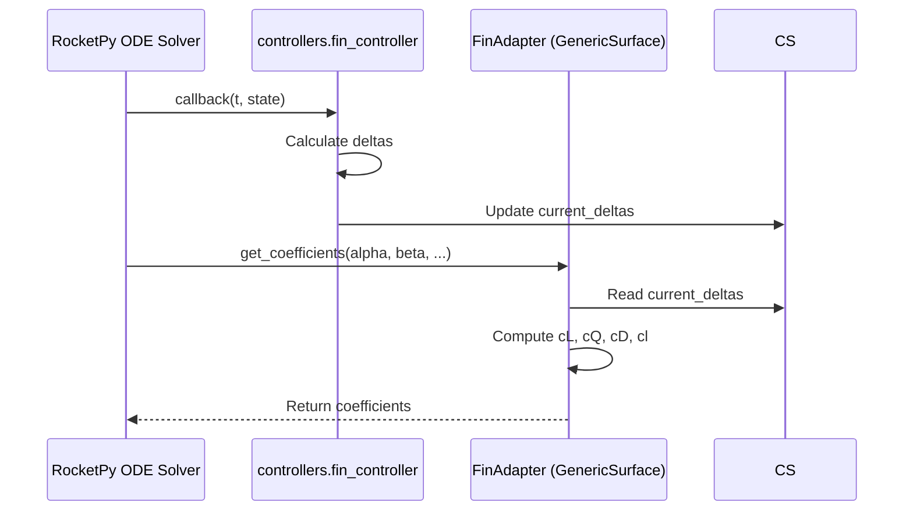

# Module: `src/fin_model.py`

## Overview

The `FinAdapter` class bridges the controller's fin deflection commands to RocketPy's `GenericSurface` aerodynamic coefficients. It serves as the interface between the control logic and the physical simulation.

## Architecture

The system uses a module-level singleton `_CONTROLLER_STATE` to share state between the controller callback and the aerodynamic model. This ensures that even if RocketPy deep-copies the rocket object, all instances of `FinAdapter` point to the same live controller data.

## Aerodynamic Model

The adapter computes incremental aerodynamic coefficients based on the fin deflections $\delta_1, \delta_2, \delta_3, \delta_4$.

### 1. Fin Mixing

The deflections are grouped into virtual control angles for pitch, yaw, and roll:

$$\delta_{pitch} = \frac{\delta_2 - \delta_4}{2}$$
$$\delta_{yaw} = \frac{\delta_1 - \delta_3}{2}$$
$$\delta_{roll} = \frac{\delta_1 + \delta_2 + \delta_3 + \delta_4}{4}$$

### 2. Force Coefficients

The lift and side force coefficients are linear functions of the pitch and yaw deflections:

$$C_L = C_{N,\delta} \cdot \delta_{pitch}$$
$$C_Q = C_{y,\delta} \cdot \delta_{yaw}$$

Where $C_{N,\delta}$ and $C_{y,\delta}$ are the normal and side force derivatives (per radian) defined in the rocket TOML.

### 3. Moment Coefficients

The roll moment coefficient is a linear function of the average roll deflection:

$$C_l = C_{l,\delta} \cdot \delta_{roll}$$

The pitch ($C_m$) and yaw ($C_n$) moment coefficients are set to **zero**:

$$C_m = 0, \quad C_n = 0$$

**Reason**: In RocketPy's `GenericSurface`, forces ($C_L, C_Q, C_D$) are applied at the component's Center of Pressure (CP). RocketPy automatically calculates the resulting moments based on the distance from the CP to the rocket's Center of Gravity (CG). Returning non-zero $C_m$ or $C_n$ would result in double-counting the control moments.

### 4. Drag Coefficient

The model includes induced drag proportional to the square of the generated control forces:

$$C_D = k_{drag} \cdot (C_L^2 + C_Q^2)$$

Where $k_{drag}$ is the induced drag factor.

## Class: `FinAdapter`

### Methods

#### `get_coefficients_dict()`
Returns a dictionary of `rocketpy.Function` objects mapping to the coefficient methods. These functions are evaluated by RocketPy at each integrator step.

#### `cl_coeff`, `cq_coeff`, `cd_coeff`, `cl_roll_coeff`
Individual coefficient callbacks. They accept the full RocketPy aerodynamic state (`alpha`, `beta`, `mach`, `reynolds`, `rates`) but currently only depend on the controller's `current_deltas` and fixed derivatives.

## Configuration (TOML)

The following parameters in the `[control_actuation]` section of the rocket TOML govern the `FinAdapter` behavior:

- `cN_delta_per_rad`: Normal force derivative.
- `cy_delta_per_rad`: Side force derivative.
- `cl_delta_per_rad`: Roll moment derivative.
- `k_drag_induced`: Induced drag factor.

## Implementation Notes

- **Incremental Model**: This adapter only handles the *increment* due to control surfaces. Passive stability (fins, nose, body) is handled by other RocketPy objects.
- **Frame Convention**: The signs of $C_L$ and $C_Q$ are calibrated to match RocketPy's aerodynamic frame, where $C_L$ acts in the transverse plane.
