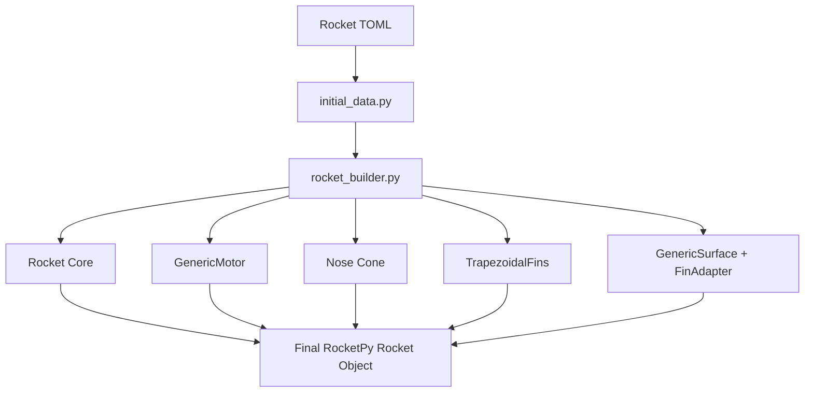

# Module: `src/rocket_builder.py`

## Overview

The `rocket_builder.py` module is responsible for assembling the virtual rocket within the RocketPy environment. It integrates the mass properties, motor characteristics, and aerodynamic surfaces (both passive and active).

## Rocket Assembly Flow

## Component Positioning

RocketPy uses a coordinate system along the longitudinal axis. In this project, the orientation is set to **tail-to-nose**:
- **0**: Rocket tip (nose).
- **Positive values**: Moving toward the tail.

| Component | Position in TOML | Calculation for RocketPy |
| :--- | :--- | :--- |
| **Nose Cone** | `[nosecone].position_m` | `position_m` |
| **Motor** | `[body].length_m` | `-length_m` (tail) |
| **Control Fins** | `[fins].position_from_tail_m` | `-position_from_tail_m` |
| **Passive Fins** | `[fins].position_from_tail_m` | `-position_from_tail_m` |

## Key Functions

### `build_rocket(case_data, config, controller_state)`
Constructs the full rocket assembly. It also initializes the `FinAdapter` with the shared `controller_state` and registers the aerodynamic coefficients.

### `export_rocket_creation_artifacts(...)`
Saves a snapshot of the rocket configuration, including the effective parameters used during the simulation, to the results directory. This ensures reproducibility.

## Control Surface Integration

The controlled fins are implemented as a `GenericSurface`. Unlike standard fins, their aerodynamic coefficients are dynamic functions:

1.  A `FinAdapter` instance is created.
2.  The adapter generates a dictionary of `rocketpy.Function` objects.
3.  These functions are passed to the `GenericSurface` constructor.
4.  The `GenericSurface` is added to the rocket at the specified aerodynamic center.

## Motor Model

The project uses the `GenericMotor` class, which allows for precise definition of:
- Thrust curve (from CSV).
- Mass depletion over time.
- Moving Center of Gravity (CG) and changing inertia tensors during burn.
