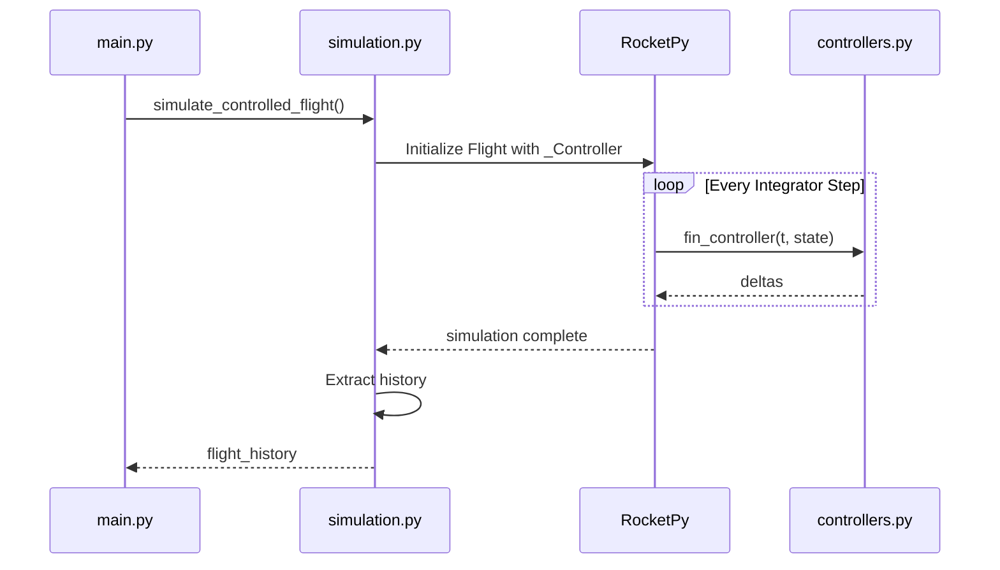

# Module: `src/simulation.py`

## Overview

Orchestrates the 6-DOF flight simulation by connecting RocketPy's physics engine with the control logic.

## RocketPy Integration

Uses the `_Controller` infrastructure to allow custom logic during the ODE integration.

## Key Functions

### `simulate_controlled_flight(...)`
1. Locates the controlled surface in the rocket assembly.
2. Injects the `fin_controller` callback.
3. Runs the `Flight` simulation until apogee.
4. Extracts integrated states and controller diagnostics.

### `export_results(...)`
Saves simulation artifacts to `results/YYYYMMDD_HHMMSS/`:
- `flight_history.csv`: Full time-series data.
- `metrics.json`: Trajectory tracking performance.
- `plots/`: Visual analysis of the flight.

## Coordinate Systems

RocketPy's global geodetic state is converted to a local **East-North-Up (ENU)** frame for control:

$$\vec{p}_{local} = \vec{p}_{absolute} - \vec{p}_{launch}$$

The controller computes outputs in the **Body Frame**, where $+Z$ is the nose of the rocket.
