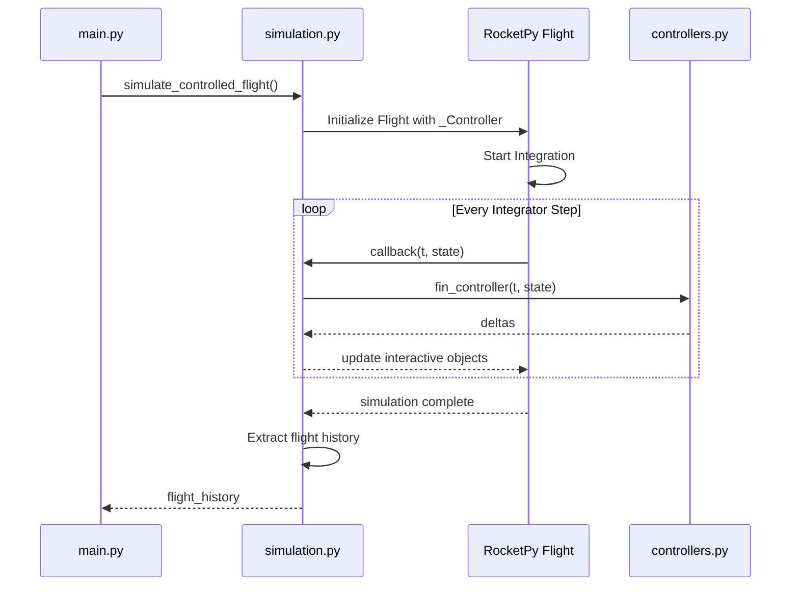

# Module: `src/simulation.py`

## Overview

The `simulation.py` module manages the execution of the 6-DOF flight simulation. it acts as the orchestrator that connects RocketPy's physics engine with the custom control logic.

## RocketPy Integration

The project leverages RocketPy's internal `_Controller` infrastructure to implement closed-loop control. This allows the controller to be invoked directly by the ODE solver during the integration process.

## Key Functions

### `simulate_controlled_flight(...)`
The core function that runs the simulation. It:
1.  Locates the `GenericSurface` within the rocket assembly.
2.  Creates a `_Controller` object with the `fin_controller` callback.
3.  Injects the controller into the rocket.
4.  Executes the `Flight` simulation.
5.  Extracts and post-processes the results into a standardized history format.

### `export_results(...)`
Handles the persistence of simulation data. it creates a timestamped directory and saves:
- **CSV Data**: Full flight history and summary.
- **JSON Data**: Performance metrics and configuration snapshot.
- **Artifacts**: Copies of the input TOML and generated plots.

## Data Conversion

RocketPy operates in a global geodetic frame. To facilitate analysis and control, `simulation.py` performs the following conversions:

1.  **Local ENU**: Translates absolute coordinates to a local East-North-Up frame with the origin at the launch pad:
    $$\vec{p}_{local} = \vec{p}_{absolute} - \vec{p}_{launch}$$
2.  **History Alignment**: Since the ODE solver uses adaptive timestepping, the controller callbacks and the solver output nodes might not align. The module performs a nearest-neighbor reconstruction to associate the correct fin deflections with each flight state.

## Implementation Details

- **Private API Usage**: The use of `rocket._add_controllers()` is a workaround to enable closed-loop control in RocketPy v1.12.1.
- **Apogee Termination**: The simulation is configured to terminate at apogee to focus on the ascent control phase.
- **Idempotency**: The integration ensures that repeated calls to the controller at the same simulation time (common in adaptive solvers) do not corrupt the integral states or history.
